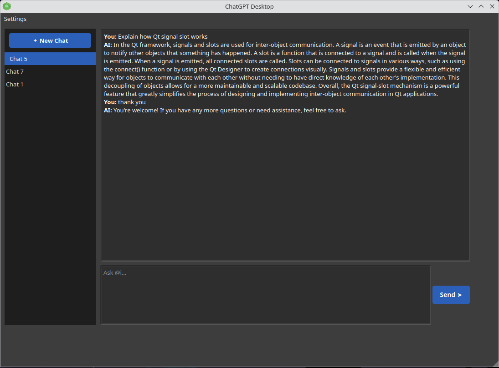

# ai-SX ChatGPT Desktop

**ai-SX ChatGPT Desktop** is a native Linux desktop application built with **Qt5** that provides a clean, persistent interface for interacting with the official **OpenAI ChatGPT API**.

The application installs and behaves like a proper Linux desktop program: it integrates with the application menu, uses system icons, stores data locally, and updates through the system package manager.

---

## Screenshot



---


---

## Project Status

**Release v1.2**

Core functionality, desktop integration, and RPM packaging are working and verified.
Flatpak packaging is in preparation.

---

## Features

- Native Qt5 desktop application (no browser dependency)
- **Responsive UI** — chat area and sidebar resize with the window
- **Collapsible sidebar** — drawer-style toggle to maximize chat space
- **Markdown rendering** — AI responses display with proper formatting (paragraphs, code blocks, lists, bold, italic, headings)
- Persistent conversation history with multiple chat threads
- SQLite-based local storage
- Secure per-user API key storage
- Dark, distraction-free interface
- Proper desktop integration (menu entry, icon, Wayland support)
- Full conversation context sent with each request

---

## Supported Platform

Currently **tested and packaged** for:

- **openSUSE Leap 16.0 (x86_64)**

Distribution is handled via **Open Build Service (OBS)** and installs using `zypper`.

---


## Installation (openSUSE Leap 16.0)

Add the repository:

```bash
sudo zypper ar -f https://download.opensuse.org/repositories/home:/L_Don_X/16.0/ ai-sx
```

Refresh repositories and accept the signing key:

```bash
sudo zypper refresh
```

Install the application:

```bash
sudo zypper install ai-sx-chatgpt-desktop
```

### Updating

Updates are handled normally through the package manager:

```bash
sudo zypper refresh
sudo zypper update ai-sx-chatgpt-desktop
```

---

## Launching the Application

Launch from the desktop application menu, or run from a terminal:

```bash
chatgpt-desktop
```

---

## Configuration

### API Key Setup

1. Launch the application
2. Open **Settings**
3. Enter your OpenAI API key (create one at [platform.openai.com/api-keys](https://platform.openai.com/api-keys))
4. Select your preferred model
5. Save and start chatting

### Local Storage

- **Configuration:** `~/.config/AXEM-SX/chatgpt-desktop.conf`
- **Chat history database:** `~/.ai-chatgpt.db`

All data remains local to the user's machine.

---

## Relationship to AXEM-SX and Golda.Global

ai-SX ChatGPT Desktop is a user-facing application developed within the broader AXEM-SX technology chair.

AXEM-SX operates under Golda.Global, alongside related initiatives such as GoudDi.
This application represents a concrete desktop tool within that ecosystem, without attempting to replace or redefine the underlying operating system.

---

## License

MIT License — see the [LICENSE](LICENSE) file for details.

---

## Support

- **Issues:** [github.com/DonX/ai-sx-chatGPT-desktop/issues](https://github.com/DonX/ai-sx-chatGPT-desktop/issues)
- **OpenAI API:** [platform.openai.com/docs](https://platform.openai.com/docs)

> **Note:** This application requires an OpenAI API key. API usage is billed by OpenAI according to their pricing. This project is not affiliated with or endorsed by OpenAI.
